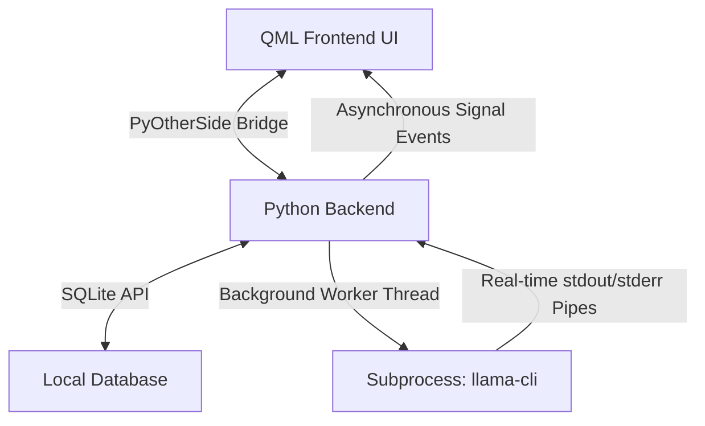

# UTGPT

An offline AI chat application built specifically for Ubuntu Touch, allowing users to run lightweight Large Language Models (LLMs) directly on their mobile device.

## Features

- Local Model Manager: Download and manage lightweight GGUF models (such as Qwen2.5, TinyLlama, and SmolLM2) directly in the application.
- Dual Model Selector: Seamless switch active models from either the main Chat screen header or the Settings page.
- Performance Tuning: Configure CPU thread limits, context size limits, and Flash Attention in Settings to optimize inference speed and memory consumption on mobile devices.
- Persistent Settings: Preserves configurations like selected model, temperature, maximum tokens, threads, context limit, and flash attention state using Qt local settings.
- Interactive Inference Control: Stop active text generation at any time to conserve CPU cycles, battery, and memory.
- Safe Session Management: Prevents token leakage when switching chat histories while generation is in progress.
- Rich Text Responses: Renders response output using Markdown formatting for code blocks, headers, and lists.
- Copy to Clipboard: Copy assistant messages instantly with visual confirmation feedback.
- Animated Thinking State: Displays a dynamic thinking indicator while waiting for the model to prepare the first token.
- Local Execution: Run chats entirely offline, keeping conversations private.

## Architecture

The application is structured into three primary layers:



### 1. Frontend (QML & Lomiri Components)
- **User Interface**: Designed using native Ubuntu Touch UI elements and styling tokens, providing an immersive, premium user experience. Includes a swipeable left sidebar drawer for session histories, a primary chat area, and responsive action sheets.
- **Persistent Settings**: Leverages `Qt.labs.settings` to persistently save and restore configuration parameters such as the active model name, inference temperature, maximum token lengths, CPU thread allocations, context boundaries, and flash attention configurations.
- **Signal Handlers**: Connects to the PyOtherSide bridge to reactively update message lists, download statuses, and generation states as events are emitted by Python.

### 2. Backend Bridge (PyOtherSide)
- Serves as the asynchronous communication conduit between the QML client and the Python environment.
- Translates dynamic JavaScript call parameters into standard Python positional and keyword arguments.
- Pushes streamed tokens and execution completion states to the client using system event payloads (inference_token, inference_done).

### 3. Database & System Core (Python)
- **Database (SQLite)**: Stores chat metadata, individual sessions, and full conversation records. Performs local query lookups to retrieve relevant history context for the LLM prompts.
- **Subprocess Executor**: Dynamically builds execution arguments for the local binary (llama-cli or llama-completion). Appends fine-tuning performance arguments like thread count (-t, -tb), context window limit (-c), and flash attention (-fa).
- **Thread Coordinator**: Spawns independent I/O monitoring threads that poll subprocess stdout and stderr streams, buffers the text, identifies boundary templates, and relays character tokens to PyOtherSide without locking the main application thread.
- **Process Registry**: Tracks active inference processes in a thread-safe global container (ACTIVE_PROCESSES) under lock control. This allows for safe, instantaneous termination of the inference engine when the user stops generation, deletes a session, or switches chat histories.

## How It Works

1. **Initialization**: On startup, the application verifies the local binary presence. If absent, a background download retrieves the compatible target release.
2. **Model Download**: GGUF models are fetched from Hugging Face repositories using HTTP chunk streaming and stored in the local storage directory.
3. **Chat Inference**:
   - Tapping send appends the query to the active message model and invokes the Python backend.
   - The backend runs database insertion operations, formats a chat prompt using system templates, and starts the llama-cli subprocess in a background thread.
   - The thread reads generated characters from stdout, emitting them token-by-token back to QML.
   - If the user stops the response, deletes the active chat, or switches to a different session, the running subprocess is instantly killed and any partial generation is cleanly saved before reloading.

## Build and Run

To build and run the application on your computer or onto a connected Ubuntu Touch device, use Clickable:

```bash
# Run locally on your desktop
clickable desktop

# Install and run on a connected Ubuntu Touch device
clickable
```

## License

Copyright (C) 2026 Suraj Yadav

Licensed under the MIT License. See the LICENSE file for details.
